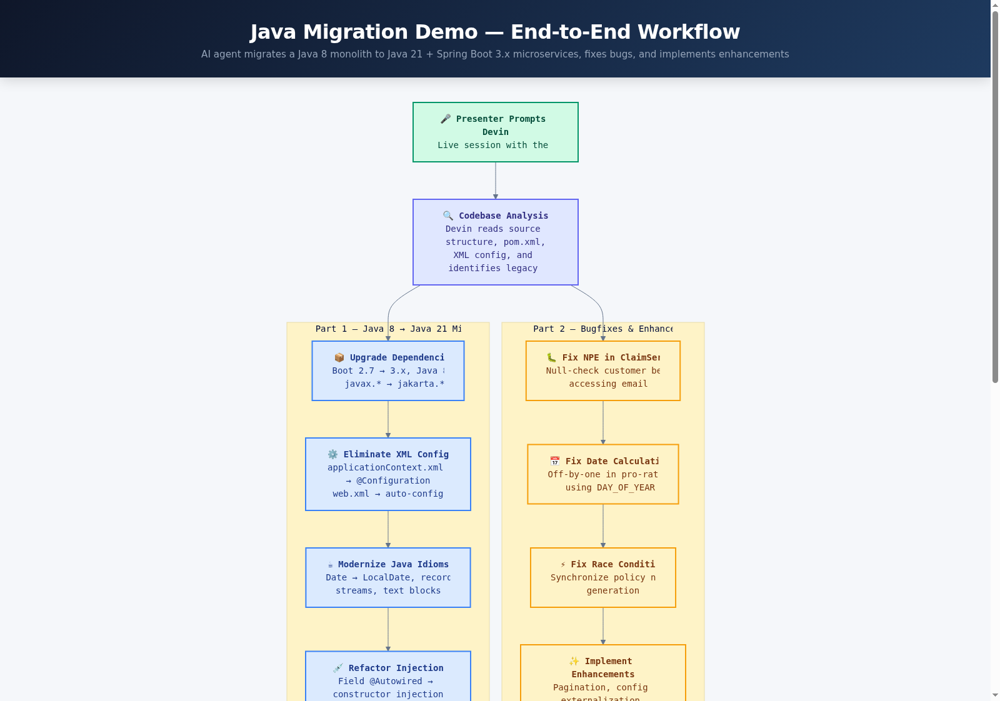

# Java Migration Demo — Java 8 Monolith to Java 21 + Spring Boot


## Demo Workflow

> End-to-end pipeline: presenter prompts Devin → Devin migrates, fixes, enhances → PR with full diff.
> For the full interactive version, see [`docs/flowchart.html`](docs/flowchart.html).



## What This Demo Shows

An AI agent takes a realistic Java 8 enterprise monolith — an insurance policy management system with XML-based Spring configuration, legacy date/time APIs, field injection, and seeded bugs — and performs a complete migration to Java 21 + Spring Boot 3.x in a single live session. The agent also identifies and fixes bugs and implements enhancement TODOs, opening a PR with the full diff.

## What Devin Does Live

Devin analyzes the Java 8 monolith, upgrades the Maven dependencies (Boot 2.7→3.x, javax→jakarta), eliminates XML configuration in favor of auto-config, modernizes Java idioms (Date→LocalDate, records, var, streams), refactors field injection to constructor injection, fixes three seeded bugs (NPE in ClaimService, off-by-one date calculation in PremiumCalculator, race condition in PolicyNumberGenerator), and implements enhancement TODOs (pagination, config externalization, input validation). The audience sees the Swagger UI, Thymeleaf dashboard, and the PR diff as visual proof.

## How the Demo Runs

**Trigger**: The presenter prompts Devin in a live session with the repo URL and a migration instruction.

**What Devin does end-to-end**:
1. Clones and analyzes the monolith structure
2. Upgrades `pom.xml` — Spring Boot 2.7.18→3.x, Java 8→21, javax→jakarta namespace
3. Replaces `applicationContext.xml` and `web.xml` with annotation-based auto-configuration
4. Modernizes all Java source: `java.util.Date`→`java.time.LocalDate`, adds records, `var`, streams
5. Refactors `@Autowired` field injection to constructor injection
6. Fixes the three seeded bugs and implements TODO/FIXME enhancements
7. Runs `mvn verify` to confirm the build passes
8. Opens a PR with the complete migration diff

**Visual artifacts**: Swagger UI (`/swagger-ui.html`), Thymeleaf dashboard (`/dashboard`), H2 Console (`/h2-console`).

### Local Development

```bash
git clone https://github.com/tedfoley-cog/java-migration-demo.git
cd java-migration-demo
mvn spring-boot:run
# Swagger UI:   http://localhost:8080/swagger-ui.html
# Dashboard:    http://localhost:8080/dashboard
# H2 Console:   http://localhost:8080/h2-console  (JDBC URL: jdbc:h2:mem:insurancedb)
```

## Repo Layout

```
java-migration-demo/
├── docs/
│   ├── IMPLEMENTATION_PLAN.md        ← Detailed implementation plan and research
│   ├── flowchart.html                ← Interactive demo flow (Mermaid)
│   └── flowchart.png                 ← Flowchart image for README
├── src/main/java/com/acme/insurance/
│   ├── InsuranceApplication.java     ← Boot main class with @ImportResource (legacy)
│   ├── config/AppConfig.java         ← Partial Java config (incomplete migration)
│   ├── controller/
│   │   ├── PolicyController.java     ← REST API for policies
│   │   ├── ClaimController.java      ← REST API for claims
│   │   └── DashboardController.java  ← Thymeleaf dashboard
│   ├── model/                        ← JPA entities (Policy, Claim, Customer, enums)
│   ├── repository/                   ← Spring Data JPA repos + native SQL queries
│   ├── service/
│   │   ├── PolicyService.java        ← Policy logic (field injection, no pagination)
│   │   ├── ClaimService.java         ← Claims logic (BUG: NPE on null customer)
│   │   ├── PremiumCalculator.java    ← Premium math (BUG: off-by-one date calc)
│   │   └── PolicyNumberGenerator.java← Sequence gen (BUG: race condition)
│   ├── dto/                          ← Manual DTOs (verbose, no Lombok/MapStruct)
│   └── util/                         ← Legacy DateUtils + hardcoded Constants
├── src/main/resources/
│   ├── application.properties        ← H2, Swagger, Thymeleaf config
│   ├── applicationContext.xml        ← Legacy XML bean definitions
│   ├── data.sql                      ← Seed data (5 customers, 7 policies, 5 claims)
│   └── templates/dashboard.html      ← Thymeleaf dashboard template
├── src/main/webapp/WEB-INF/web.xml   ← Legacy deployment descriptor
├── pom.xml                           ← Maven build (Boot 2.7.18, WAR packaging)
├── DEMO_NOTES.md                     ← Presenter cheat sheet
└── .github/workflows/ci.yml          ← CI: JDK 8 + mvn verify
```

## Key Concepts

| Term | Description |
|---|---|
| **Spring Boot 2.7 → 3.x** | Major version jump requiring Java 17+, javax→jakarta namespace migration |
| **javax → jakarta** | Java EE namespace change mandated by Eclipse Foundation (Jakarta EE 9+) |
| **XML Configuration** | Legacy Spring pattern using `applicationContext.xml` for bean definitions |
| **Field Injection** | Using `@Autowired` on fields directly — harder to test, hides dependencies |
| **Constructor Injection** | Modern pattern — dependencies declared in constructor, enables immutability |
| **java.util.Date** | Legacy mutable date class — replaced by `java.time.LocalDate` in modern Java |
| **WAR Packaging** | Traditional deployment to external app servers — Boot 3.x typically uses JAR |
| **Pro-Rata Refund** | Proportional premium refund based on remaining policy term |
| **H2 Console** | Embedded database web UI for inspecting data at `/h2-console` |

## Seeded Bugs (Part 2)

| # | Location | Bug Type | Description |
|---|---|---|---|
| 1 | `ClaimService.approveClaim()` | NullPointerException | Dereferences `policy.getCustomer().getEmail()` without null check — crashes on orphaned data |
| 2 | `PremiumCalculator.calculateProRataRefund()` | Off-by-one | Uses `Calendar.DAY_OF_YEAR` difference instead of actual elapsed days — wrong for cross-year policies |
| 3 | `PolicyNumberGenerator.nextPolicyNumber()` | Race condition | Non-synchronized read-then-increment — concurrent requests can produce duplicate policy numbers |

## Seeded Enhancements

| Location | Enhancement |
|---|---|
| `PolicyService.getAllPolicies()` | TODO: add pagination — currently loads all policies |
| `Constants.java` | FIXME: hardcoded tax rate and policy prefix — should be externalized |
| `ClaimService.fileClaim()` | TODO: add input validation — negative claim amounts accepted |
